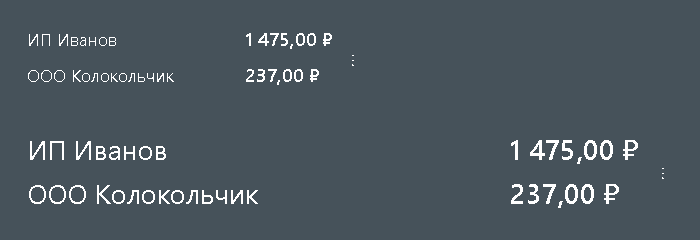

# KRS Эквайринг Монитор

Настраиваемый оверлей сумм эквайринга по организациям для Frontol 6 и Сбербанк UPOS. Показывает одну или две строки поверх активной кассы, считает суммы по журналу операций и работает в трее.

Актуальный выпуск — **0.2.5**. Стрелки обновления больше нет: ручная сверка запускается двойным щелчком по любой сумме. Ширина меняется за правый край, шрифт — в настройках с живым предпросмотром.

> Демонстрационная отрисовка настоящего оверлея: компактный вариант и вариант с увеличенным шрифтом. Названия и суммы вымышленные, данные клиента не использованы.

> **Известное ограничение:** на полевой конфигурации UPOS ручная сверка возвращает `report-format`. В 0.2.5 эта ошибка ещё не исправлена: нераспознанный отчёт не применяется, прежние суммы по журналу сохраняются. Автоматический расчёт по журналу и проверка обновлений программы — отдельные механизмы.

## Что умеет

- показывает одну или две строки «организация + сумма» без общего итога;
- обновляет расчёт из существующего sbkernelYYMM.log примерно за секунду после завершения операции;
- учитывает успешные оплаты и возвраты по Department, игнорирует отказы;
- обнуляет обе организации только после полного успешного закрытия банковской смены;
- восстанавливает текущие суммы после перезапуска, включая последнюю ручную сверку;
- появляется поверх активного Frontol примерно за секунду и скрывается в остальных программах, кроме предпросмотра в настройках;
- не меняет положение при появлении модальных окон Frontol;
- позволяет перетащить строки за название, изменить ширину за правый край и запоминает положение и ширину;
- отдельно настраивает размер шрифта с живым предпросмотром;
- по двойному щелчку по любой сумме запрашивает текущий отчёт всех организаций непосредственно у терминала;
- показывает состояние запроса в подсказке к суммам и откладывает небезопасный ручной запрос до завершения операции;
- автоматически заполняет отсутствующие названия организаций из однозначного банковского отчёта;
- установленная версия проверяет официальные обновления GitHub при запуске и каждые 6 часов;
- работает в трее и умеет запускаться вместе с Windows.

Программа не использует ККТ и не печатает документы.

## Требования

- Windows 10 или Windows 11;
- Microsoft .NET Framework 4.8;
- Frontol 6;
- установленный Сбербанк UPOS;
- 32-разрядная pilot_nt.dll и включённый журнал sbkernelYYMM.log;
- обычная учётная запись Windows, без прав администратора.

Windows 7 не поддерживается. Приложение и банковский помощник собраны как x86.

## Безопасность банковских операций

Главное приложение читает файлы UPOS только на чтение и вообще не загружает pilot_nt.dll. Ручной запрос выполняется отдельным процессом Krs.AcquiringMonitor.TerminalQuery.exe, поэтому сбой банковского компонента не должен закрыть оверлей.

Единственный разрешённый вызов терминала:

~~~text
Экспорт:             _get_statistics
Соглашение вызова:   cdecl
Сигнатура:           int get_statistics(auth_answer*)
TType:               0 (краткий текущий отчёт)
Amount, CType:       0
RCode[3]:            нули
AMessage[16]:        нули
Размер auth_answer:  35 байт в x86
Результат:           текст отчёта через Check
Освобождение Check:  GlobalFree
~~~

Перед вызовом помощник проверяет PE32/x86, размер структуры и наличие именно _get_statistics. Он никогда не ищет и не вызывает _close_day, card_authorize, LoadParm.exe или числовые команды.

Подробнее: [заметки по безопасности](docs/SECURITY-NOTES.md).

## Установка

### Установщик — рекомендуется

1. Скачайте `KRS-AcquiringMonitor-0.2.5-setup.exe` из [GitHub Releases](https://github.com/jadieify-hub/krs-acquiring-monitor/releases).
2. Запустите установщик от обычной учётной записи; права администратора не требуются.
3. После установки программа стартует сама и по умолчанию добавляет себя в автозапуск текущего пользователя.
4. При первом запуске выберите существующую папку UPOS/SC552.

Установленная версия умеет обновляться автоматически. Если неподписанная сборка вызывает предупреждение SmartScreen, сверяйте источник и контрольную сумму релиза; не отключайте защиту Windows целиком.

### Portable

1. Скачайте архив `KRS-AcquiringMonitor-0.2.5-win-x86.zip` из [GitHub Releases](https://github.com/jadieify-hub/krs-acquiring-monitor/releases).
2. Распакуйте его в отдельную папку, доступную обычному пользователю.
3. Запустите Krs.AcquiringMonitor.exe.
4. При первом запуске выберите существующую папку UPOS/SC552.

Не копируйте банковские DLL в папку приложения. Указывайте существующую папку, которую установил и настроил специалист Сбербанка.

Официальными считаются только файлы из GitHub Releases этого репозитория.

## Первый запуск и настройка

Утилита ищет UPOS в таком порядке:

1. ранее сохранённая папка;
2. папка приложения;
3. типовые каталоги Sberbank в Program Files;
4. SC552 в корне локальных дисков.

Если ничего не найдено, открывается окно настроек. Для отделов 1 и 2 можно указать короткие подписи вручную. Если организация одна, второе поле оставьте пустым. Пустое поле позже заполняется из банковского отчёта. Введённое пользователем название не перезаписывается.

Подпись на экране хранится отдельно от названия, найденного в банковском отчёте. Поэтому кассир может переименовать строку, не нарушив дальнейшее сопоставление организаций с отделами.

При открытых настройках оверлей принудительно виден, даже если Frontol не активен. Меняйте ширину и размер шрифта в полях, передвигайте оверлей за название или тяните правый край ⋮. Всё видно сразу. «Сохранить» запоминает изменения, «Отмена» и закрытие окна крестиком возвращают прежние размеры и положение.

Перетягивание края меняет только ширину, не шрифт. Вне настроек ширина и положение сохраняются сразу после отпускания мыши. При слишком узком окне сокращается название, а полная сумма сохраняется; если для неё не хватает места, оверлей остаётся шире заданного значения. Минимальная задаваемая ширина — 200 пикселей. Ширина указана для масштаба Windows 100%, на остальных масштабах пересчитывается автоматически.

Примеры автоматического сокращения:

- ИП Иванов Иван Иванович → ИП Иванов;
- ООО «Колокольчик» → ООО Колокольчик.

Настройки и последнее безопасное состояние находятся в:

~~~text
%LOCALAPPDATA%\KRS\AcquiringMonitor
~~~

## Работа кассира

Обычно ничего нажимать не нужно: после успешной банковской операции журнал меняется, и оверлей обновляется почти сразу. Отказ банка и незавершённая операция сумму не меняют.

Для принудительной сверки с текущим отчётом терминала отдельная кнопка не нужна:

1. дождитесь завершения оплаты или возврата;
2. дважды щёлкните левой кнопкой мыши по любой сумме либо выберите «Обновить» в меню трея;
3. приложение принимает отчёт только если нашло однозначную сумму для всех ожидаемых организаций;
4. при частичном или непонятном отчёте прежние суммы остаются без изменений.

Неизвестное значение показывается как —. Названия всегда белые, суммы — белые при актуальных данных и янтарные при устаревании, отложенном запросе или ошибке сверки. Сами числа при ошибке не меняются. Фона и обводки нет. Во время запроса над суммой показан курсор ожидания; повторный двойной щелчок не запускает ещё один запрос. Подсказка при наведении на любую сумму объясняет жест и состояние. Ошибка ручного запроса дополнительно показывается сообщением, даже если значок трея скрыт.
Подтверждённый ручной итог становится новой базой: после перезапуска к нему добавляются только последующие завершённые операции из журнала.

Если журнал недоступен, в нём осталась незавершённая операция или выполнено только первое из двух закрытий, ручной запрос сохраняется и запускается сам, когда монитор снова станет безопасным. Повторять двойной щелчок не нужно. Отчёт с одной организацией принимается только тогда, когда единственный отдел уже обнаружен по журналу либо задан в настройках; так обрезанный отчёт двух организаций не будет ошибочно принят за полный.

В меню значка рядом с часами доступны настройки, обновление сумм, сброс положения, справка, поддержка разработки и выход. Пункт «Обновить» и двойной щелчок по сумме запрашивают **данные терминала**, а не новую версию программы.

## Как разбирается отчёт

pilot_nt.dll возвращает текст Check в CP866. Оригинал живёт только во временном файле на время запроса и не пишется в диагностический лог.

Ниже синтетический обезличенный пример тестового формата, а не ответ терминала клиента:

~~~text
ИП Иванов Иван Иванович
ОПЛАТА                 1 500,00
ВОЗВРАТ                  250,00
ИТОГО                  1 250,00

ООО «Колокольчик»
ИТОГО                  8 900,00
~~~

Парсер предпочитает единственную строку ИТОГО. Если её нет, он использует единственные значения ОПЛАТА/ПОКУПКА минус ВОЗВРАТ. Противоречащие друг другу суммы не угадываются и не применяются.

## Какие файлы переносить на кассу

Из готовой portable-сборки:

~~~text
Krs.AcquiringMonitor.exe
Krs.AcquiringMonitor.exe.config
Krs.AcquiringMonitor.Core.dll
Krs.AcquiringMonitor.TerminalQuery.exe
Krs.AcquiringMonitor.TerminalQuery.exe.config
support-qr.png
README.md
CHANGELOG.md
LICENSE
docs\ACCEPTANCE-CHECKLIST.md
docs\SECURITY-NOTES.md
docs\screenshots\overlay.png
~~~

pilot_nt.dll, pinpad.ini и остальные файлы Сбербанка остаются в установленной папке UPOS. Они не входят в релиз.

## Обновление программы

Автообновление работает только у копии, установленной через setup.exe; portable-копия сама не обновляется. Отдельной кнопки «Проверить новую версию» пока нет.

Чтобы сразу проверить обновление в установленной **0.2.3 или новее**:

1. Дождитесь завершения банковской операции, закройте настройки и справку монитора.
2. В меню значка монитора выберите «Выход» и снова запустите программу её ярлыком.
3. Проверка опубликованного релиза начнётся примерно через 3 секунды. После загрузки установка дождётся 30 секунд без банковской активности.

Перезагружать кассовый компьютер не требуется. Без перезапуска монитор проверяет новые версии каждые 6 часов. Текущая версия указана в «Справке». Если опубликованной версии новее текущей нет, ничего не устанавливается.

Переход со старой portable-копии выполняется один раз вручную: запустите установщик актуальной версии. Установщик перенесёт существующую запись автозагрузки на установленную копию; настройки и суммы останутся в профиле пользователя.

Установленная версия 0.2.5 проверяет `update.json` последнего официального GitHub Release через несколько секунд после запуска и затем каждые 6 часов, в том числе после неудачной проверки. Перезагрузка кассового компьютера не нужна. Более новый установщик скачивается в LocalAppData и проверяется по SHA-256. Установка ждёт 30 секунд без банковской активности, запроса статистики и открытых окон приложения; перед запуском хеш проверяется ещё раз.

Монитор сохраняет безопасную контрольную точку и завершает только свой процесс. Установщик ждёт его выхода не более 30 секунд, затем устанавливает новую версию и запускает монитор. Frontol не останавливается, Windows не перезагружается. Если старый процесс не вышел, установка отменяется; диагностика находится в `%LOCALAPPDATA%\KRS\AcquiringMonitor\updates\installer.log`. Этот журнал содержит технические пути установки: перед отправкой удалите имя пользователя и другие личные сведения.

Установщик 0.2.5 можно запустить вручную поверх предыдущей установленной версии. Если старый монитор не закрывается штатно, системный Restart Manager принудительно завершает процессы, использующие заменяемые файлы монитора. Frontol и отдельная portable-копия не входят в этот список. Делайте это в спокойное время, не во время запроса к терминалу: несохранённые изменения старого окна настроек при принудительном завершении могут потеряться. Уже сохранённые настройки и суммы остаются в профиле пользователя.

Для первого перехода с 0.2.2 и старее рекомендуется запустить установщик 0.2.5 вручную: в старых версиях ещё нет периодической проверки и исправлений завершения процесса. Portable-версию обновляйте заменой файлов после выхода через трей.

Репозиторий и официальные релизы публичны, поэтому авторизация GitHub и токен на кассе не нужны.

Сборки пока не подписаны Authenticode. SHA-256 защищает от повреждения и подмены файла относительно опубликованного манифеста, но доверие к выпуску зависит от учётной записи издателя GitHub.

## Удаление

Установленную версию удаляйте через «Приложения» Windows — деинсталлятор также уберёт запись автозапуска. Для portable-версии сначала снимите «Запускать вместе с Windows» в настройках и завершите приложение через трей, затем удалите распакованную папку. Пользовательские настройки при необходимости удаляются отдельно из `%LOCALAPPDATA%\KRS\AcquiringMonitor`.

## Известные ограничения 0.2.5

- поддерживается только Сбербанк UPOS/pilot_nt.dll;
- распознаются Department 1 и 2, максимум две организации;
- для автоматического расчёта в UPOS должен быть включён sbkernel-журнал;
- на полевой конфигурации UPOS 34.9.3 остаётся ошибка `report-format`; исправление требует обезличенного текста реального ответа, а не догадок по суммам на экране;
- до подтверждённой ручной сверки нельзя считать итог оверлея проверенным банковским отчётом; порядок проверки описан в [чек-листе](docs/ACCEPTANCE-CHECKLIST.md);
- разработчик не выполнял живой вызов на предоставленной копии SC552: без подключённого терминала это не доказывает безопасность и могло бы создать ложный результат;
- сборка пока не подписана коммерческим сертификатом.

## Сборка из исходников

Нужны .NET SDK с поддержкой сборки .NET Framework 4.8 и установленный targeting pack 4.8.

~~~powershell
dotnet build Krs.AcquiringMonitor.sln -c Release -p:Platform=x86
dotnet run --project tests/Krs.AcquiringMonitor.Tests/Krs.AcquiringMonitor.Tests.csproj -c Release -p:Platform=x86
powershell -NoProfile -ExecutionPolicy Bypass -File build/build-release.ps1 -Version 0.2.5
~~~

Для полного релиза нужен Inno Setup 6. Скрипт запускает тесты, собирает x86 Release и создаёт в `artifacts` portable-архив, установщик и двухпольный `update.json` с SHA-256.

Дополнительные локальные проверки, не использующие реальную кассу:

~~~powershell
dotnet run --project tests/Krs.AcquiringMonitor.Tests/Krs.AcquiringMonitor.Tests.csproj -c Release -p:Platform=x86 -- --measure-idle
.\build\test-manual-update.ps1 -IsccPath "C:\Path\To\Inno Setup 6\ISCC.exe"
.\build\test-installer-handoff.ps1 -IsccPath "C:\Path\To\Inno Setup 6\ISCC.exe"
~~~

Первый замер сравнивает CPU отслеживания окна и чтения неизменившегося синтетического журнала. Два сценария установщика используют безвредные тестовые процессы и файлы в artifacts, не меняют автозапуск и рабочую установку.

## Приватность и диагностика

Телеметрии нет. Простое открытие раздела поддержки не обращается к сети. Диагностический журнал содержит время, версию, тип события и безопасный технический код. В него не записываются PAN, RRN, код авторизации, текст чека или исходный банковский отчёт.

Перед отправкой сообщения об ошибке не прикладывайте боевую папку SC552 целиком. Создайте issue в этом репозитории и укажите версию программы, Windows, Frontol и UPOS; приложите только обезличенные строки по инструкции из SECURITY-NOTES.md.

Сообщить о проблеме: [GitHub Issues](https://github.com/jadieify-hub/krs-acquiring-monitor/issues).

## Поддержать разработку

Поддержка полностью добровольная: https://pay.cloudtips.ru/p/2f23e8c9

Та же ссылка и локальный QR-код доступны в меню «Поддержать разработку». Оверлей не показывает просьбы о донате и не мешает кассиру.

## Авторство и лицензия

Разработчик: Руслан Керусов

Издатель и владелец: KRS

Исходный код распространяется по лицензии MIT. См. [LICENSE](LICENSE).
История выпусков ведётся в [CHANGELOG.md](CHANGELOG.md).
